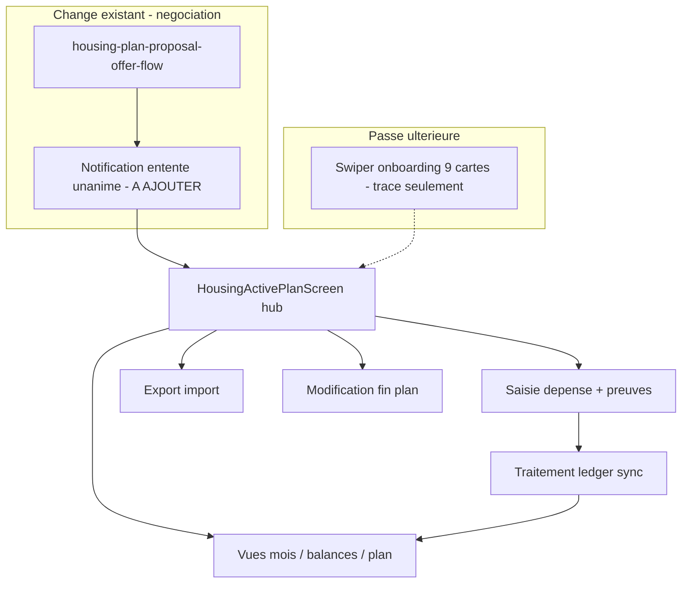

# Specs — plan logement actif (premier tri)

## Clarification : le « hub »

Oui : le **hub** désigne le **menu principal** affiché une fois l’entente **active** — aujourd’hui le placeholder [`HousingActivePlanScreen`](mobile/lib/screens/housing/housing_active_plan_screen.dart) (« Plan actif » vide). Ce sera l’écran d’accueil opérationnel avec les boutons que vous avez listés :

- Entrer une dépense
- Dépenses du mois en cours
- Balances dues de chacun
- Consulter le plan actuel
- Demander une modification du plan
- Exporter / importer les données

Le hub **ne remplace pas** la saisie : il **route** vers les flux (saisie, vues lecture, export, renegotiation). La spec **saisie** décrit le formulaire et les preuves ; le hub peut être décrit dans le `design.md` du change (navigation) sans dupliquer tout le métier.

---

## Décisions de périmètre (vos précisions)

| Sujet | Décision |
|--------|----------|
| Notification « Nous avons une entente unanime! » | **Hors** des nouvelles specs saisie/export/modif → **delta** sur [`housing-plan-proposal-offer-and-responses`](openspec/changes/housing-plan-proposal-offer-and-responses/) (émission par l’appareil du **dernier** accepteur, deep-link vers le hub ou le module logement). |
| Swiper bienvenue (9 cartes) | **Passe ultérieure** — garder une **note** dans `design.md` ou `repo-maintenance-backlog` : « UX onboarding post-activation requis » ; **ne pas** recopier le texte des cartes dans les specs pour l’instant. |
| Regroupement des idées | **3 specs produit** + **1 spec traitement** (voir ci-dessous). |

---

## Architecture OpenSpec proposée

**Un change parent** (recommandé) : `housing-active-agreement-operations`  
Contient **quatre** capability specs + `proposal.md` / `design.md` / `tasks.md` découpés par passes.

Alternative acceptable : 4 changes séparés si vous préférez des PR/reviews isolées — plus lourd à maintenir.

### Spec 1 — Saisie d’une dépense réalisée (+ preuves)

**Fichier cible :** `specs/housing-realized-expense-entry/spec.md`

**In scope (tri brut → exigences à affiner en itérations) :**

- Point d’entrée depuis le **hub** (« Entrer une dépense »).
- Lier la saisie à une **ligne du plan actif** (`PlanLine` / poste budgétaire), pas une saisie libre hors plan.
- Champs métier minimum (à préciser itération 2) : montant réel, date de paiement, payeur, type **dépense normale** vs **remboursement** (part de A payée par B) vs **avance** — aligné avec votre note carte 6.
- **Preuves** : photo / capture / document **optionnelles mais fortement suggérées** ; pipeline **crop → compression → qualité** avant persistance ; stockage dans un répertoire **accessible à l’utilisateur** sur l’appareil.
- Export JSON : **chemin local seulement** (pas d’embarquement du binaire) — renvoi vers spec 2.
- Consultation passée : si fichier déplacé → afficher le **nom de fichier**, pas une erreur technique opaque.
- Réutilisation cible : logique de montant / ratios inspirée de [`housing-expense-line-form`](openspec/changes/housing-unified-expense-entry/specs/housing-expense-line-form/spec.md), mais **modèle distinct** « dépense réalisée » vs ligne de plan (à définir en spec 4).

**Hors scope spec 1 :**

- Acceptation/refus par les pairs, soldes, vues mensuelles → spec 4.
- Export/import bundle → spec 2.
- Corrections de plan → spec 3.

**Composants / écrans (niveau grossier) :**

- `HousingActivePlanScreen` (hub — navigation seulement dans design)
- `HousingRealizedExpenseFormScreen` (nouveau)
- `ProofAttachmentCapture` (crop/compress, path storage)
- Sélecteur de ligne de plan (picker filtré sur plan actif)
- Service persistance locale brouillon + soumission → handoff spec 4

---

### Spec 2 — Export / import des données d’une entente

**Fichier cible :** `specs/housing-agreement-data-portability/spec.md`

**In scope :**

- Export **module logement seulement**, **une entente** = période + **chaîne de révisions** du plan acceptées pendant cette entente (votre « succession de modifications » incluse).
- Format JSON **versionné**, **non chiffré**, **checksum** intégré pour décourager l’import « traffiqué ».
- Chemins de preuves : références par path local ; pas de copie des images dans le bundle.
- Import sur **autre appareil** (récupération après perte) — règles de validation checksum + compatibilité version.
- UX : item hub « Exporter / importer » ; message sécurité (fichier en clair, rangement prudent) — carte 8/9 de vos idées, sans recopier le texte marketing.

**Question design (à trancher en itération 2, pas bloquant pour le tri) :**

> *« Est-ce que l’export peut produire le MÊME fichier pour tous les participants ? »*

**Réponse de principe pour la spec :**

- **Non par défaut** si l’export = « tout ce que *mon* appareil sait » (propositions en attente, chemins de preuves locaux, horodatages d’acceptation locaux) — les exports **diffèrent** entre participants.
- **Oui en théorie** seulement pour un export **canonique d’entente** : sérialisation **déterministe** (ordre stable des entités, IDs de sync du protocole, contenu hashé, **sans** paths locaux — hashes ou noms de fichiers seulement) des données **unanimement acceptées** par le groupe. Ce mode serait un **sous-type d’export** optionnel (« état partagé de l’entente ») pour secours croisé, pas le backup quotidien par appareil.
- L’import d’un export **d’un autre participant** reste possible mais la spec doit exiger : vérification checksum, correspondance `packageId` / révision active, et règles de fusion ou remplacement (à détailler en itération 3).

**Liens :** étendre [`client-db-exportability`](openspec/changes/client-db-selection/specs/client-db-exportability/spec.md) par delta housing-scoped.

---

### Spec 3 — Modification et fin d’un plan (entente)

**Fichier cible :** `specs/housing-agreement-amendment-and-closure/spec.md`

**In scope :**

- **Corrections de plan** une à une, chacune = proposition soumise à **approbation unanime** (réutilise [`contract-unanimous-renegotiation`](openspec/changes/expense-plan-contract-model/specs/contract-unanimous-renegotiation/spec.md) + offer flow existant).
- Types de modification autorisés (votre liste) :
  - Prix d’une dépense planifiée
  - Récurrence
  - Responsable du paiement (ligne plan)
  - Ajout / retrait de dépense planifiée
  - Date de fin d’entente
  - Changement / ajout / retrait de règle
- **Hors modification** (nécessite **fin d’entente + nouvelle entente**) :
  - Changement de participant
  - Retrait d’un participant (unanime ou non)
- **Prolongation** d’entente via demande de modification (changement date fin).
- **Fin d’entente** puis nouvelle entente : plan **forkable** depuis l’actif pour éviter ressaisie manuelle (aligné workbench / fork existant).
- Entrée hub : « Demander une modification du plan » + « Consulter le plan actuel » (lecture seule du snapshot actif).

**Hors scope :** saisie des dépenses réalisées (spec 1), export (spec 2).

---

### Spec 4 — Traitement des données après saisie (ledger)

**Fichier cible :** `specs/housing-realized-expense-ledger/spec.md`

*(Conserve votre demande initiale d’une spec « traitement » séparée — elle ne rentre pas proprement dans export/modif.)*

**In scope (tri des cartes 4–6 + sync existant) :**

- Soumission → **proposition** relay E2EE ([`data-locality-and-client-storage`](openspec/changes/privacy-first-sync-architecture/specs/data-locality-and-client-storage/spec.md) : pas d’écriture ledger accepté sans accept explicite).
- Notification quand un colocataire saisit une dépense → file de **vérification** : accepter ou refuser **avec justification** ; resoumission après refus.
- **Unanimité par dépense** (chaque dépense réalisée acceptée par tous avant impact « soldes publiés »).
- Vues hub : **dépenses du mois en cours** (+ historique mois précédents — détail UI itération ultérieure).
- **Balances dues** dérivées des dépenses acceptées + ratios du plan actif ; remboursements/avances comme types de mouvement.
- Seuil « Budgeté (max) » : alerte / confirmation — reprend les intentions **D.2** de [`housing-unified-expense-entry/tasks.md`](openspec/changes/housing-unified-expense-entry/tasks.md) mais **ici** (plan actif).
- Déclenchement **essai / licence** au premier sync de dépense réalisée ([`free-until-active-plan-use`](openspec/changes/licensing-trial-and-plan-entitlement/specs/free-until-active-plan-use/spec.md)).

**Composants grossiers :**

- Tables / entités `RealizedExpense` (nom provisoire), états `draft | proposed | accepted | rejected`, pièces jointes par référence path.
- Orchestrateur sync (enveloppes à définir — **client-first**, relay delta minimal).
- `HousingExpenseReviewQueue` / écran détail accept-refus.
- Moteur balances + agrégation mensuelle (réutiliser [`splitMinorByWeights`](mobile/lib/housing/split_minor_by_weights.dart) côté calcul).

---

## Tri des idées brutes → specs

| Idée brute | Spec |
|------------|------|
| Notification unanimité | **Delta** `housing-plan-proposal-offer-flow` |
| Swiper 9 cartes | **Backlog / note UX** (passe ultérieure) |
| Hub menu 6 boutons | **design.md** + routage ; écrans détaillés dans specs 1–4 |
| Saisie + photo/preuve | **Spec 1** |
| Réduction taille fichier preuve | **Spec 1** |
| Path dans export, nom si fichier manquant | **Spec 1** (lecture) + **Spec 2** (export) |
| Accept/refus dépense, justification, resoumettre | **Spec 4** |
| Notif dépense colocataire | **Spec 4** (+ prefs notifications) |
| Sommaire mois / balances | **Spec 4** (vues depuis hub) |
| Remboursement / avance | **Spec 1** (saisie) + **Spec 4** (calcul) |
| Modification plan (liste) | **Spec 3** |
| Fin entente / fork / prolongation | **Spec 3** |
| Export/import JSON checksum, une entente | **Spec 2** |
| Même export pour tous participants | **Spec 2** (section canonique — voir ci-dessus) |

---

## Existant à réutiliser (sans redétailler)

| Actif | Usage |
|-------|--------|
| [`ExpensePlanLineForm`](mobile/lib/housing/expense_form/expense_plan_line_form_screen.dart) | Inspiration UX ; **pas** le même objet métier que dépense réalisée |
| [`housing-plan-proposal-offer-flow`](openspec/changes/housing-plan-proposal-offer-and-responses/specs/housing-plan-proposal-offer-flow/spec.md) | Renegotiation / fork / activation |
| [`contract-unanimous-renegotiation`](openspec/changes/expense-plan-contract-model/specs/contract-unanimous-renegotiation/spec.md) | Loi de groupe pour modifs plan |
| Privacy-first proposal/accept | Ledger sync spec 4 |
| `HousingActivePlanScreen` | Remplacer stub par hub |

---

## Itérations de rédaction suggérées

1. **Itération A** — Créer le change OpenSpec + **squelettes** des 4 specs + note swiper + tâche delta notification dans `housing-plan-proposal-offer-and-responses`.
2. **Itération B** — Rédiger **spec 1** (saisie + preuves) + hub navigation dans `design.md`.
3. **Itération C** — Rédiger **spec 4** (ledger : états, unanimité, vues mois/balances) — le cœur métier le plus lourd.
4. **Itération D** — **Spec 3** (modifs / fin / fork) puis **spec 2** (export/import + checksum + modes backup vs canonique).
5. **Itération E** — Swiper onboarding (change ou tâches UX séparées) une fois le hub utilisable.

---

## Prochaine action après validation du plan

Lancer `openspec new change housing-active-agreement-operations` et rédiger l’itération A (artefacts vides structurés + une exigence ADDED dans `housing-plan-proposal-offer-flow` pour la notification d’unanimité).

**Pas d’implémentation** tant que les specs 1 et 4 n’ont pas au moins un premier jet d’exigences + scénarios (sinon risque de coder le mauvais modèle de données).
