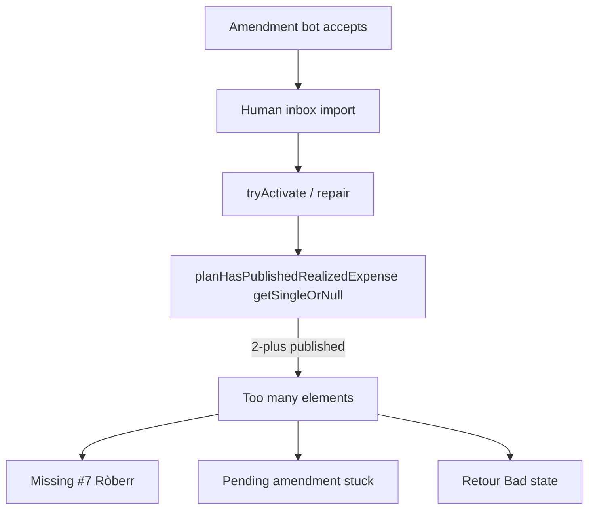

# Sandbox cumulative QA fixes

## Root cause (blocking #10 / #11 / #12)

[`planHasPublishedRealizedExpense`](mobile/lib/housing/amendment/housing_agreement_start_date_policy.dart) uses Drift `getSingleOrNull()` on published realized expenses. After bot + human + transfer expenses, there are **≥2** published rows → `Bad state: Too many elements`.

That exception aborts amendment activation mid-inbox (`terminal.log` ~L3946), which explains:

- Missing 5th #7 (Ròberr) after Monica
- Pending amendment left open → purple tile / “déjà des réponses”
- Retour → housing entry load failure

## Confirmed notification copy

| Case | Title | Body |
|---|---|---|
| Human is payer, normal expense | Dépense acceptée | `{name} a accepté votre dépense.` |
| Human is payer, **transfer** | **Virement accepté** | `{name} a accepté votre virement.` |
| Human is **not** payer (bot expense) | Dépense acceptée | `{name} a accepté la dépense de {payer}.` |
| Human not payer + transfer (if ever notified) | Virement accepté | `{name} a accepté le virement de {payer}.` |

EN/ES parallels in the same ARB keys.

## Implementation

### 1. P0 — existence check (unblocks #10/#11/#12)

In [`housing_agreement_start_date_policy.dart`](mobile/lib/housing/amendment/housing_agreement_start_date_policy.dart): replace `getSingleOrNull()` with a non-throwing existence query (e.g. `.get()` + `isNotEmpty`, or `limit(1)`).

Add a focused unit test: two published expenses for one plan → returns `true`, does not throw.

### 2. #9 — stagger proposal/amendment bot accepts

In [`peer_simulator.dart`](mobile/lib/sandbox/peer_simulator.dart) `reactOnce` / `_autoAcceptPendingProposals`: after each bot that newly accepts a pending proposal/amendment, wait `_realizedExpenseBotDecisionDelay` (1s) before the next bot’s accept — same cadence as realized-expense reviews. Log delays for QA.

### 3. #3 / #7 — notification #6 copy

- Extend ARB strings (FR/EN/ES) for transfer title/body and peer-payer body (`… de {payer}`).
- Update [`showLocalHousingRealizedExpenseAcceptedNotification`](mobile/lib/notifications/push_notification_service.dart) to take expense `kind` + whether local user is payer + optional `payerDisplayName`.
- Update call sites: [`handshake_orchestrator.dart`](mobile/lib/relay/handshake_orchestrator.dart) inbound accept, [`peer_simulator.dart`](mobile/lib/sandbox/peer_simulator.dart) bot-expense path (already fires when `!humanIsPayer`).

### 4. Verify

- `cd mobile && ./tool/flutterw analyze --fatal-infos .`
- Targeted test for `planHasPublishedRealizedExpense` + full `./tool/flutterw test` if anything beyond that policy file changes meaningfully.
- Manual retest note: cold sandbox cumulative 1→5; expect 5× #7 on amendment, activation without Bad state, staggered accepts, corrected #6 texts.

## Out of scope

- No relay changes.
- No change to product rule “human accepts bot expense first, then bots stagger”.
