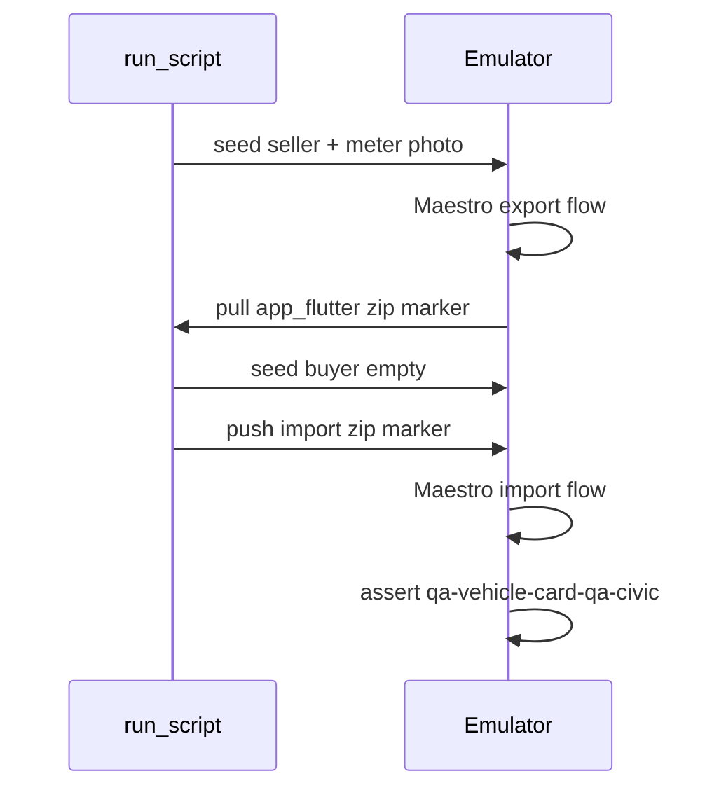

# Plan: Maestro vehicle sale export → import

## Done criteria

- **Path:** seed seller → export UI → zip recovered by coordinator → `pm clear` + seed buyer empty → import UI (debug zip, no OS picker) → hub shows imported vehicle.
- **Pass:** Maestro `assertVisible` on `qa-vehicle-card-qa-civic` after import.
- **Reference:** seed shape from [`qa_vehicle_consumption_seed.dart`](mobile/lib/debug/qa_vehicle_consumption_seed.dart); hub entry [`_enter_vehicle_hub.yaml`](qa/flows/_enter_vehicle_hub.yaml); orchestration like [`run_housing_payment_reminder_scenario.sh`](tool/run_housing_payment_reminder_scenario.sh) (dedicated script; mid-run reseed).

## Architecture choices (locked)

| Decision | Choice |
| --- | --- |
| FilePicker | Bypass in `kDebugMode` when `app_flutter/compartarenta_qa_vehicle_sale_import.zip` exists |
| Export handoff | On successful export (debug), also write zip bytes to `app_flutter/compartarenta_qa_vehicle_sale_export.zip` for `adb run-as` pull (public MediaStore path is fragile) |
| Reseed | Dedicated shell script (not plain `qa:run-scenario`) |
| Undo | Out of scope |
| Photos | One real minimal JPEG written once in seller seed; same storage key reused on all meter readings / fuel odometer / oil `meterAtService` that need a photo |

## 1. Seller seed (dense history)

New helper e.g. [`mobile/lib/debug/qa_vehicle_sale_portability_seed.dart`](mobile/lib/debug/qa_vehicle_sale_portability_seed.dart), wired in [`qa_scenario_seed.dart`](mobile/lib/debug/qa_scenario_seed.dart):

- Seed ids: `vehicle_sale_export_import_seller`, `vehicle_sale_export_import_buyer`
- Personas: seller → Monica QA (default); buyer → Louys QA via `_qaPersonaForScenario`
- Vehicle: reuse `kQaVehicleE2eDisplayLabel` / QA Civic helpers
- Window: ~2026-05-15 → 2026-07-13; `device_date` for run: `2026-07-14T12:00:00` / `America/Toronto` (local-only, no relay)
- Data:
  - **32** closed use sessions (start+end meter + tank), advancing odometer realistically
  - **8** full-tank fuel purchases with meter
  - **1** maintenance `oil` / 4000 CAD minor (`saveMaintenanceEvent`, category wire `oil`)
- Postconditions: exact counts + no open session
- Buyer seed: prefs + empty vehicles only (like `vehicle_add` empty start)
- Unit coverage in [`qa_scenario_seed_test.dart`](mobile/test/qa_scenario_seed_test.dart)

## 2. Debug portability hooks (minimal product surface)

New small helper e.g. `mobile/lib/debug/qa_vehicle_sale_portability_io.dart` (debug-only):

- After export success in [`vehicle_detail_screen.dart`](mobile/lib/screens/vehicle/vehicle_detail_screen.dart): write zip bytes to `compartarenta_qa_vehicle_sale_export.zip`
- In [`vehicle_add_screen.dart`](mobile/lib/screens/vehicle/vehicle_add_screen.dart) `_confirmImport`: after confirm dialog, if import zip marker exists → `importZipBytes` from that file; else existing FilePicker

## 3. QA semantics (tap targets)

Add constants in [`qa_vehicle_semantics.dart`](mobile/lib/debug/qa_vehicle_semantics.dart) and wire with `button: true` + `onTap` mirroring `onPressed` where needed:

| Id | Control |
| --- | --- |
| `qa-vehicle-detail-export` | Export button on detail |
| `qa-vehicle-export-confirm` / `qa-vehicle-export-cancel` | Confirm dialog |
| `qa-vehicle-export-success-done` | Success dialog Done |
| `qa-vehicle-import-action` | Import on add form |
| `qa-vehicle-import-confirm` / `qa-vehicle-import-cancel` | Import confirm dialog |

Dialogs today live in [`vehicle_sale_portability_dialogs.dart`](mobile/lib/vehicle/portability/vehicle_sale_portability_dialogs.dart) without ids — add Semantics there (same pattern as gap dialogs).

## 4. Maestro flows

- [`qa/flows/vehicle_sale_export.yaml`](qa/flows/vehicle_sale_export.yaml): `_enter_vehicle_hub` → tap `qa-vehicle-card-qa-civic` → wait detail → export → confirm → success done
- [`qa/flows/vehicle_sale_import.yaml`](qa/flows/vehicle_sale_import.yaml): `_enter_vehicle_hub` → `qa-vehicle-add-fab` → import → confirm → wait hub → assert `qa-vehicle-card-qa-civic`

No `text:` for in-app taps. No inflated timeouts.

## 5. Orchestrator + melos

New [`tool/run_vehicle_sale_export_import_scenario.sh`](tool/run_vehicle_sale_export_import_scenario.sh):

1. Start emulator, build/install APK, set clock
2. `seed_qa_scenario.sh vehicle_sale_export_import_seller`
3. Maestro export flow (`--udid`, log serial)
4. Pull export zip via `run-as` → host artifact dir
5. Seed buyer (`vehicle_sale_export_import_buyer`) — one seed only per phase
6. Push zip as `compartarenta_qa_vehicle_sale_import.zip` under `app_flutter`
7. Maestro import flow
8. Restore clock; artifacts under `qa/artifacts/vehicle_sale_export_import/<stamp>/`

Melos script `qa:run-vehicle-sale-export-import` in root `pubspec.yaml` (mirror payment-reminder style). **Do not** add a `qa/scenarios/*.yaml` that `run_all` would run as a single-seed flow.

Short English note in [`docs/qa-android-e2e.md`](docs/qa-android-e2e.md) for how to run it.

## 6. Validation loop

1. `python3 tool/verify_qa_semantics.py`
2. Seed unit tests + `flutter analyze --fatal-infos` / targeted tests if `mobile/` touched
3. Full script run (rebuild APK after Dart semantics/hooks)
4. Green artifacts before claim PASS

## Out of scope

- Undo import Maestro steps
- OS FilePicker click sequence
- Multi-device / relay
- Asserting full journal contents beyond hub card visibility (step 5 as requested)