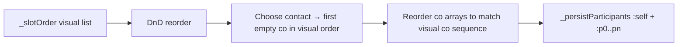

# Wizard step 1 — participant grid UI

## Scope

- **Only** step 0 UI in [`mobile/lib/screens/housing/housing_plan_screen.dart`](mobile/lib/screens/housing/housing_plan_screen.dart) (`_stepParticipants`, `_HousingContactParticipantCard`, related helpers).
- **Do not** change validation, contact picker sheet, `_persistParticipants` contract (`:self` + `:p0…p{n-1}`), draft autosave of contact/name/avatar, withdrawal/ratios/roster helpers, or Maestro ids (`kQaHousingWizardChooseContact`, `kQaHousingWizardParticipantsStep`).

## Product decisions (locked)

| # | Choice |
|---|--------|
| 1B | All grid cells are reorderable, including the local user. |
| 2A | « Choisir un contact » fills the **first empty** co-slot (`?`) in **current visual order** (never assigns a contact to the self cell). |

## How order maps to existing logic (no roster-model rewrite)

Today co-order is the parallel arrays `_nameControllers` / `_contactIds` / `_avatarIds` written as `:p0…pn`. Self is always `:self`. Downstream roster sort still prefers `:self` first (`rosterOrderForPlanParticipantId`) — **unchanged**.



- Keep an in-memory **`_slotOrder`**: list of length `1 + _otherParticipantCount`, each entry is either `self` or co-index `0..n-1`.
- Grid renders `_slotOrder` left-to-right, top-to-bottom (2 columns). Self cell shows profile display name; empty co cells show `?`; filled co cells show contact name.
- **DnD** reorders `_slotOrder` only (stable co-index identities → no mix-up when filling a name after a drag).
- After DnD (and before persist / when count changes): **project** visual co-sequence back onto the parallel arrays so `:p0` = first co in visual order, etc. Self never becomes a `:p*` row.
- Self’s **visual** position is session UI state; it does not rewrite `:self` id or global roster-order helpers. Co **persisted** order becomes the reordered co sequence (no longer “order of addition via Prev/Next”).

## UI changes (match annotated screenshots)

**Remove** from `_stepParticipants`:

- Row `housingPlanPreviousPerson` / `housingPlanNextPerson` (`_coEditorIndex` pager).
- Current `_HousingContactParticipantCard` framing that shows « Co-participant N », red `housingPlanContactRequired` inside the card, and the choose-contact button **inside** that card.

**Keep / move**:

- `+/-` participant count header (unchanged).
- Footer `Suivant` (unchanged).
- « Choisir un contact » / « Changer de contact » with existing `kQaHousingWizardChooseContact` semantics — **below** the grid, **outside** any full-width blue card frame.

**Add**:

- 2-column grid, `2×1` … `2×4` for total participants `2…8` (`_otherParticipantCount` still `1…7`).
- Cell chrome: same **light blue** as today’s step card / surface tint — **no yellow**.
- Empty co: centered `?`. Self: always shows local name (prefs), never `?`, never opened by choose-contact.

Replace `_HousingContactParticipantCard` with smaller tile widgets + one standalone choose-contact button (or slim the card to button-only).

## Contact assignment (2A) without mix-ups

Replace `_coEditorIndex`-based targeting:

```dart
int? _firstEmptyCoIndexInVisualOrder() {
  for (final slot in _slotOrder) {
    if (slot.isSelf) continue;
    if (_contactIds[slot.coIndex] == null) return slot.coIndex;
  }
  return null;
}
```

- Button enabled when that index is non-null (same gate as today: all cos must have contacts before Next).
- `_chooseContactForParticipant(thatIndex)` unchanged (exclusions, picker, autosave).
- If all co-slots filled, button can switch to « Changer de contact » only if we keep change-on-focused behavior — **default**: when no empty slot, disable or no-op choose; changing an existing contact can be a later tap-on-filled-cell if needed — **for this change**: button calls picker only for first empty; do not invent a new “replace” UX unless the existing label path already requires it when `hasContact` on the old single card. Simplest match: button always targets first empty; if none empty, disable button (Next already requires all filled). Drop the old « Changer de contact » path on this screen unless trivial to keep via long-press on a filled tile — **plan: disable button when no empty slot** (user can still shrink count / clear by reducing participants). If reducing count already drops trailing editors, that remains the clear path.

Re-check `_applyOtherParticipantCount`: rebuild `_slotOrder` when `n` changes — keep existing self + co entries in relative order; append new empty co slots at end of visual order; drop removed co indices.

## DnD implementation

No new package. Custom 2-col reorder with `LongPressDraggable` + `DragTarget` (or equivalent) over a `GridView`/`Wrap`, mirroring patterns already used elsewhere in this file for expense reorder (`ReorderableListView`). On accept: swap/reorder `_slotOrder`, `setState`, then sync co arrays to visual co order, autosave draft.

## Files

- Primary: [`mobile/lib/screens/housing/housing_plan_screen.dart`](mobile/lib/screens/housing/housing_plan_screen.dart)
- QA flows that only assert `qa-housing-wizard-choose-contact` / participants step should keep working; update only if hierarchy breaks (read [`qa/flows/_housing_wizard_open_contact_picker.yaml`](qa/flows/_housing_wizard_open_contact_picker.yaml) after UI change).

## Verify

- `cd mobile && ./tool/flutterw analyze --fatal-infos .`
- `cd mobile && ./tool/flutterw test` (or targeted housing wizard tests if present; full suite before delivery).
- Manual: cold `./tool/melosw run run:dev` — count 3–8, DnD including self, add contacts into first `?` after reorder, Next still persists cos as `:p0…` in visual co order.
