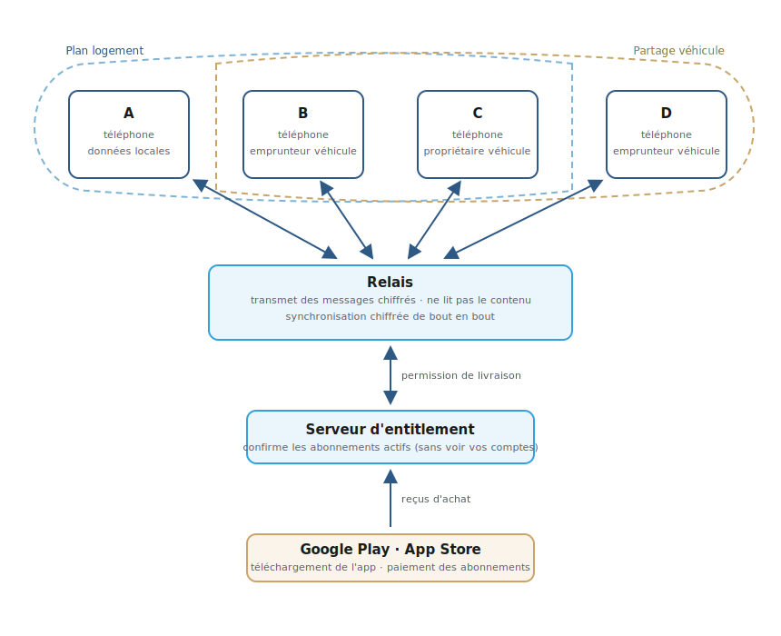
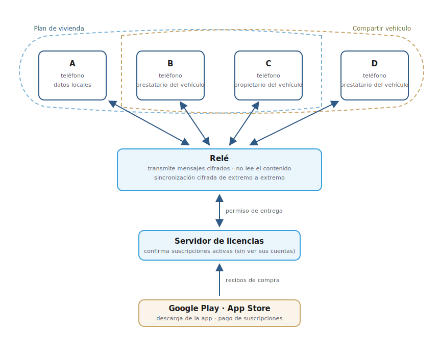

# Compartarenta

**[English](#en)** · **[Español](#es)**

Compartarenta est une application mobile qui aide les colocataires à modéliser une entente, négocier à l'unanimité chaque détail et tenir les comptes par la suite. Le site web descriptif de l'application est <a href="https://compartarenta.incoherences.org" target="_blank">https://compartarenta.incoherences.org</a>.

## Architecture

Compartarenta est **local-first** : l'entente, les dépenses et les comptes vivent d'abord sur le téléphone de chaque participant. Rien n'est « centralisé dans le cloud » au sens d'une base de données partagée que le serveur pourrait lire.

Quand les participants doivent se mettre d'accord ou se tenir à jour, leurs applications échangent des **messages chiffrés** via un **relais** sur Internet. Le relais fait office de boîte aux lettres : il achemine les enveloppes sans en lire le contenu, puis les efface une fois livrées.

Certaines actions (par exemple un plan logement actif) exigent un **abonnement valide**. L'application s'appuie alors sur un **serveur d'entitlement** qui confirme simplement si la licence est active — toujours sans accès aux détails de vos comptes.

Vous **installez** l'application et **payez** l'abonnement via **Google Play** (Android) ou l'**App Store** (iOS). Les boutiques gèrent le paiement ; le serveur d'entitlement valide cet achat pour autoriser, le cas échéant, le relais à transmettre certains messages.

Exemple : **A**, **B** et **C** partagent un plan logement ; **C** (propriétaire) prête aussi sa voiture à **B** et **D** (emprunteurs) — **A** n'est que dans le logement, **D** n'est que dans le partage véhicule, **B** et **C** sont dans les deux.

  

## Licence

Ce projet est publié sous la Elastic License 2.0 (ELv2). Voir `LICENSE`.

En termes simples : vous pouvez utiliser, étudier, modifier et partager ce logiciel librement, y compris à des fins personnelles ou internes. En revanche, vous ne pouvez pas proposer ce logiciel (ou une version dérivée) comme service en ligne payant ou géré pour d'autres personnes — par exemple en l'hébergeant pour des clients qui n'installent pas l'application eux-mêmes.

## Informations juridiques et litiges

Voir `docs/legal-and-disputes.md` pour la transparence sur la licence, le comportement en cas de défaut de paiement et la portée limitée du produit en matière de litiges.

Pour plus de détails mis à jour plus régulièrement, consultez les liens suivants :

- [Divulgations produit](https://compartarenta.incoherences.org/fr/legal/divulgations/)
- [Politique de confidentialité](https://compartarenta.incoherences.org/fr/legal/confidentialite/)
- [Conditions d'utilisation](https://compartarenta.incoherences.org/fr/legal/conditions/)

## Développeurs

Voir `getting-started.md` pour la structure du dépôt et le démarrage de l'application Flutter.

---

**[Français](#fr)** · **[Español](#es)**

Compartarenta is a mobile app that helps roommates model an agreement, negotiate every detail by unanimous consent, and keep the books afterward. The descriptive website for the app is <a href="https://compartarenta.incoherences.org/en/" target="_blank">https://compartarenta.incoherences.org</a>.

## Architecture

Compartarenta is **local-first**: the agreement, expenses, and accounts live first on each participant's phone. Nothing is « centralized in the cloud » in the sense of a shared database the server could read.

When participants need to agree or stay in sync, their apps exchange **encrypted messages** through an Internet **relay**. The relay acts as a mailbox: it forwards envelopes without reading their contents, then deletes them once delivered.

Some actions (for example an active housing plan) require a **valid subscription**. The app then relies on an **entitlement server** that simply confirms whether the license is active — still without access to your account details.

You **install** the app and **pay** for the subscription via **Google Play** (Android) or the **App Store** (iOS). The stores handle payment; the entitlement server validates that purchase to authorize, when applicable, the relay to forward certain messages.

Example: **A**, **B**, and **C** share a housing plan; **C** (owner) also lends their car to **B** and **D** (borrowers) — **A** is in housing only, **D** is in vehicle sharing only, **B** and **C** are in both.

  

## License

This project is released under the Elastic License 2.0 (ELv2). See `LICENSE`.

In plain terms: you may use, study, modify, and share this software freely, including for personal or internal purposes. However, you may not offer this software (or a derivative version) as a paid or managed online service for other people — for example by hosting it for clients who do not install the app themselves.

## Legal information and disputes

See `docs/legal-and-disputes.md` for transparency on licensing, payment-failure behavior, and the product's limited scope regarding disputes.

For more detail, updated more regularly, see:

- [Product disclosures](https://compartarenta.incoherences.org/en/legal/divulgations/)
- [Privacy policy](https://compartarenta.incoherences.org/en/legal/confidentialite/)
- [Terms of use](https://compartarenta.incoherences.org/en/legal/conditions/)

## Developers

See `getting-started.md` for repository layout and getting the Flutter app running.

---

**[Français](#fr)** · **[English](#en)**

Compartarenta es una aplicación móvil que ayuda a los compañeros de piso a modelar un acuerdo, negociar cada detalle por unanimidad y llevar las cuentas después. El sitio web descriptivo de la aplicación es <a href="https://compartarenta.incoherences.org/es/" target="_blank">https://compartarenta.incoherences.org</a>.

## Arquitectura

Compartarenta es **local-first**: el acuerdo, los gastos y las cuentas viven primero en el teléfono de cada participante. Nada está « centralizado en la nube » en el sentido de una base de datos compartida que el servidor pudiera leer.

Cuando los participantes deben ponerse de acuerdo o mantenerse al día, sus aplicaciones intercambian **mensajes cifrados** a través de un **relé** en Internet. El relé hace de buzón: reenvía los sobres sin leer su contenido y los borra una vez entregados.

Ciertas acciones (por ejemplo un plan de vivienda activo) exigen una **suscripción válida**. La aplicación se apoya entonces en un **servidor de licencias** que confirma simplemente si la licencia está activa, siempre sin acceso a los detalles de sus cuentas.

**Instala** la aplicación y **paga** la suscripción en **Google Play** (Android) o la **App Store** (iOS). Las tiendas gestionan el pago; el servidor de licencias valida esa compra para autorizar, cuando corresponda, que el relé transmita ciertos mensajes.

Ejemplo: **A**, **B** y **C** comparten un plan de vivienda; **C** (propietario) también presta su coche a **B** y **D** (prestatarios) — **A** solo está en vivienda, **D** solo en el uso compartido del vehículo, **B** y **C** están en ambos.

  

## Licencia

Este proyecto se publica bajo la Elastic License 2.0 (ELv2). Vea `LICENSE`.

En términos sencillos: puede usar, estudiar, modificar y compartir este software libremente, incluso con fines personales o internos. En cambio, no puede ofrecer este software (o una versión derivada) como servicio en línea de pago o gestionado para otras personas — por ejemplo alojándolo para clientes que no instalan la aplicación ellos mismos.

## Información jurídica y litigios

Consulte `docs/legal-and-disputes.md` para la transparencia sobre la licencia, el comportamiento en caso de impago y el alcance limitado del producto en materia de litigios.

Para más detalles, actualizados con mayor frecuencia, consulte:

- [Divulgaciones del producto](https://compartarenta.incoherences.org/es/legal/divulgations/)
- [Política de privacidad](https://compartarenta.incoherences.org/es/legal/confidentialite/)
- [Condiciones de uso](https://compartarenta.incoherences.org/es/legal/conditions/)

## Desarrolladores

Consulte `getting-started.md` para la estructura del repositorio y el arranque de la aplicación Flutter.
