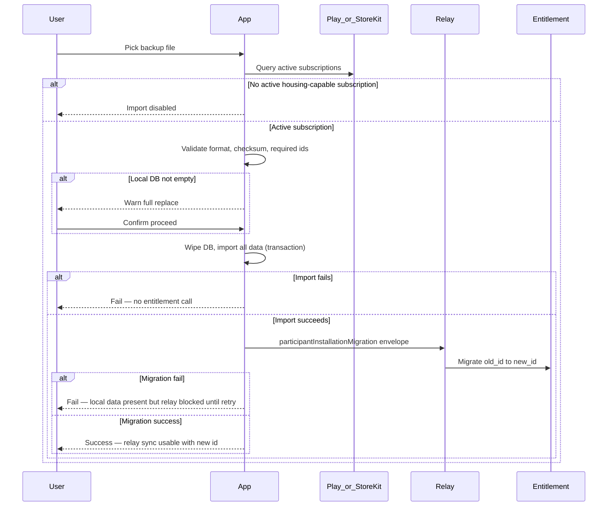

# Design — device data import and restore

## Context

Each installation has a unique `participant_installation_id`. Entitlement server and relay gating key operational authorization off that id. On device replacement, the user exports **all** local data, installs the app on a new phone, and imports — but the new installation has a **new** id. Entitlement state still references the **old** id, so relay-gated sync would fail if only local DB were restored.

Prior specs gated housing import on entitlement-server "valid housing entitlement". That is wrong for recovery: the server cannot know the new device is legitimate until after local restore and an explicit id migration.

## Decision summary (2026-06-22)

| Concern | Source of truth |
| --- | --- |
| May user tap **Import**? | **Store only** — active paid subscription for housing (standalone product **or** bundle that includes housing) on the device's store account |
| May relay accept gated envelopes? | **Entitlement server** (unchanged) |
| What is exported? | **All** local operational tables / modules in one versioned bundle |
| Where in UI? | **Settings → Export / import data** |
| Non-empty local DB? | Confirm → **wipe** → import (replacement-phone primary case) |
| After local import succeeds? | Send migration envelope → entitlement replaces old id with new **everywhere** linked |

## Import flow (ordered, atomic product semantics)

**No partial success:** If local import does not fully succeed, do **not** call entitlement. If entitlement migration fails after a successful local import, the overall restore is **incomplete** from the user's perspective until migration succeeds — but local data is already replaced.

### Edge case: relay unreachable after local DB replacement

This is **not** a failed local import. The sequence is:

1. Local wipe + import **succeeded** (new data is on device).
2. Client sends the installation migration envelope to relay.
3. Relay is **unreachable** (timeout, no HTTP response, network down, server temporarily unavailable).

Until migration succeeds, entitlement still keys the plan to the **old** `participant_installation_id`, so gated relay sync (kinds 5–9) remains blocked even though local data looks correct.

**Retry policy (transport failures only):** use the same budget as `RelayHttpPolicy` — **3 retries** after the initial attempt (4 attempts total, 30 s timeout each). If all attempts fail with no HTTP response, show a localized **network problem** message; the user may verify connectivity and **retry migration later** from Settings (without re-importing the file).

**Non-retryable migration failures** (`old_id` unknown, `plan_id` mismatch, documented deny codes) SHALL NOT be retried as network errors; show the specific failure instead.

## Store products (import gate)

Import requires an **actively billed** subscription that grants **housing** module access:

- Standalone **housing** subscription product (`store-product-mapping-per-module`), **or**
- Any **bundle** product that includes housing (`bundle-product-mapping`).

Trial periods, grace (unpaid), and expired subscriptions do **not** count as active for import.

Until billing is integrated, a **dev-only fake** MAY enable import on debug builds (documented in implementation).

## Export bundle

- **Scope:** entire local database content needed to reconstruct the installation's operational state across **all** modules (housing, contacts, car-sharing when present, preferences that belong with operational data, etc.).
- **Required metadata for migration:** at minimum `old_participant_installation_id` for the exported installation, and module-scoped plan identifiers (e.g. `plan_id` for housing) needed for migration verification.
- **Format:** versioned JSON + checksum per `client-db-exportability`.
- **Not encrypted**; security copy in UI.

## Canonical (colocataire) backup edge case

When the file is a **canonical** cross-participant snapshot (not the user's own device backup):

1. After file validation, prompt: restore data for **self** (default — show user's name) **or** pick another roster participant from the backup.
2. Proceed with wipe/import for the chosen identity context.

## Installation migration envelope

- **Kind:** `participantInstallationMigration` = **15** (kinds 10–12 are housing participation change; 13–14 are contact establishment).
- **Minimal payload:**
  - `old_participant_installation_id`
  - `new_participant_installation_id`
  - `plan_id` (housing) or analogous module plan id — **must match** entitlement record for the old id (anti-corruption).
- **Handler:** entitlement server replaces old id with new id in **all** durable records that reference it (roster slots, trial markers, expense decisions, license rows, etc.). Relay forwards; relay does not own migration logic.
- **Outcomes:** success or fail (`old_id` not found → fail). Idempotent retry when `new_id` already mapped may return success (implementation detail).

## Registration

The new installation id is registered at app bootstrap **before** migration is attempted. Migration is not a substitute for registration; it **rebinds** server-side links from old to new.

## Relay after migration

After successful migration, gated envelope kinds (5–9) SHALL introspect successfully with the **new** `participant_installation_id` without requiring a separate full roster re-publish — migration updated server state atomically.

## Non-goals

- Multi-device live sync.
- Import on production web.
- Entitlement-server participation in import button gating.

## Risks

| Risk | Mitigation |
| --- | --- |
| Billing not ready | Dev fake; button disabled in release until store query works |
| Migration relay unreachable after local wipe | Local data restored; migration retried per `RelayHttpPolicy` (3 retries); user notified on persistent network failure; manual retry later from Settings |
| Wrong Google/Apple account | Store query returns no purchase → import disabled (expected) |
| Kind number collision | Use 15; document in protocol |
