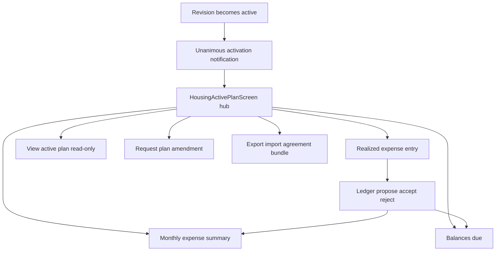

# Design — housing active agreement operations

## Context

**Before this change:** unanimous activation is specified in `housing-plan-proposal-offer-flow`; the active plan screen is a stub.

**After activation:** each participant lands in an **operations hub** and uses satellite flows for expense life cycle, reporting, amendments, and backup.

## Active agreement hub

`HousingActivePlanScreen` becomes the **hub**: a scrollable menu (not tabs) with primary actions:

| Action | Route / target | Spec |
|--------|----------------|------|
| Enter an expense | `HousingRealizedExpenseFormScreen` | `housing-realized-expense-entry` |
| Current month expenses | `HousingMonthlyExpensesScreen` | `housing-realized-expense-ledger` |
| Balances owed | `HousingBalancesScreen` | `housing-realized-expense-ledger` |
| View current plan | Read-only plan + contract snapshot | `housing-agreement-amendment-and-closure` |
| Request plan modification | Amendment wizard → existing offer/renegotiation flow | `housing-agreement-amendment-and-closure` |
| Export / import data | `HousingAgreementPortabilityScreen` | `housing-agreement-data-portability` |

The hub SHALL show the agreement label (plan title or package display name) and period dates. A secondary affordance MAY link to workbench/archive.

**Re-open onboarding swiper (deferred):** placement TBD (e.g. hub app bar help icon). See **Deferred UX** below.

## Domain split: plan line vs realized expense

| Concept | Storage | Purpose |
|---------|---------|---------|
| `PlanLine` | Existing plan tables | Budget structure, recurrence, split weights for **projection** |
| `RealizedExpense` (name TBD) | New table(s) | Actual payment event, proof refs, acceptance state, payer, type |

A realized expense **references** exactly one active `PlanLine` id at submission time. Plan amendments that retire a line MUST NOT delete historical realized rows; they remain tied to the line id with snapshot labels if needed.

## Proof attachments

- Capture: camera, gallery, or document picker.
- Pipeline: optional crop → compress (JPEG/WebP quality step) → write under an app-sanctioned directory that is **user-visible** (e.g. Android MediaStore / iOS Files export path policy — platform detail in implementation).
- Persist **relative or absolute path** + **display file name** + optional content hash in DB.
- Export bundle: path string only, not file bytes.
- Display: if path missing, show **file name** and neutral copy (“file moved or unavailable”), not a stack trace.

## Sync (high level)

Realized expenses follow **proposal / accept / reject** per `data-locality-and-client-storage`. Wire kinds documented in `housing-realized-expense-ledger` (client protocol doc alongside contacts/housing proposal docs). Relay remains opaque ciphertext transport.

Unanimous **per expense**: every participant must accept before the expense joins **published balances** on each device.

## Amendment vs new agreement

- **Amendment:** single atomic change (one price change, one line add, …) → one proposal revision → unanimous accept → patches active plan revision chain under same `packageId`.
- **Roster change:** end agreement + new proposal (fork plan from active snapshot); not an amendment type.

## Export modes

1. **Device backup (default):** everything this device knows for one agreement (accepted + pending proposals, local proof paths, local acceptance timestamps). Checksum over canonical JSON bytes. **Differs per participant.**
2. **Canonical agreement snapshot (optional, later iteration):** deterministic serialization of **group-accepted** facts only, no local paths — enables cross-participant disaster recovery import with strict validation. Specified in `housing-agreement-data-portability` as optional capability.

## Deferred UX — post-activation onboarding swiper

**Status:** not in implementation pass 1.

**Need:** After unanimous activation, participants benefit from a short **card swiper** (dismissible from any card) explaining realized expenses, proofs, peer review, balances, amendments, and export. Card copy is **not** specified in OpenSpec yet; product text lives outside the repo until a dedicated UX pass.

**Track:** `repo-maintenance-backlog` item “Housing — post-activation onboarding swiper”.

## Goals / non-goals

**Goals:** End-to-end spec coverage for in-force housing operations; hub navigation; clear separation of four capabilities.

**Non-goals:** Implementing relay server changes in the first mobile pass; specifying swiper card prose; car module.

## Migration / rollout

1. Schema migration for realized expense tables.
2. Hub replaces stub when `activeRevisionId` is set.
3. Activation notification (offer-flow task 1.23) routes to hub.
4. Licensing hook on first realized expense sync unchanged in policy, new instrumentation in ledger layer.
