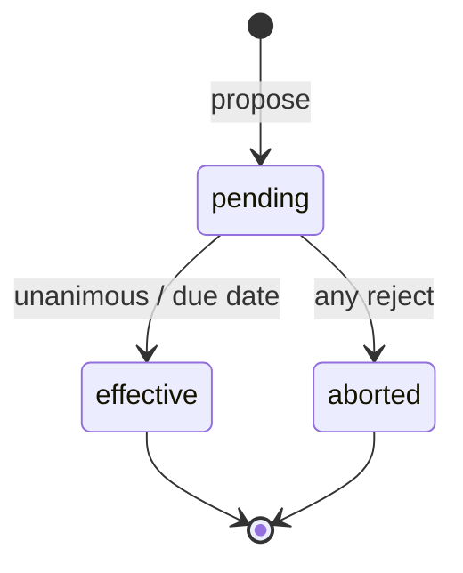

# Design — housing participation change

## State machine

## Per-participant membership

`housing_plan_memberships` drives hub title (**Entente active** vs **Entente passée**) independently per device user. Roster ratios use `participantsForPlan` filtered by active membership at redistribution time.

## Relay kinds (client-only)

| Kind | Purpose |
|------|---------|
| 10 | Propose (#1, #3) |
| 11 | Decision (accept/reject) |
| 12 | Notify (#2 info-only) |

## Ratio split

Departing participant weights redistributed with `splitMinorByWeights` over equal recipient weights (Hamilton remainder).

## Inactive participant

Created on effective #2/#3 departure for ledger closure transfers; excluded from roster and future ratios.
