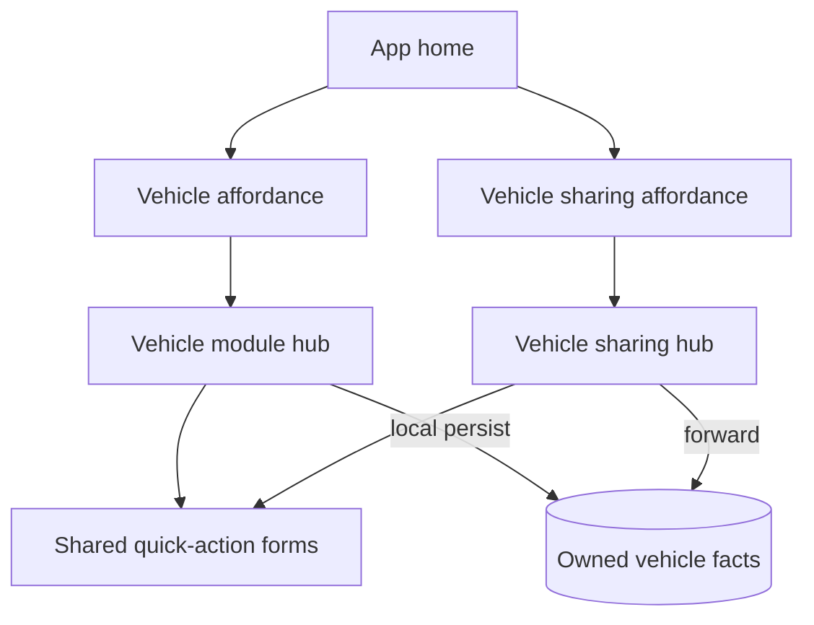

## Context

The product splits vehicle concerns into two licensed modules:

| Module | Identifier | Primary user |
| --- | --- | --- |
| **Véhicule** | `vehicle` | Owner who registers and maintains vehicle facts |
| **Partage de véhicule** | `vehicle-sharing` | Owner who shares **and/or** any participant who borrows |

This design covers **`vehicle` only**. Borrower usage entry, sharing relationships, and expense reconciliation windows are in `vehicle-sharing-module`.

Constraints:

- Local-first Flutter app; facts stored separately from derived metrics.
- One **fixed owner** per vehicle record for the lifetime of that record in the app.
- Vehicle kind is descriptive (car, truck, motorcycle at initial release; **boat deferred** — see Decisions).

## Goals / Non-Goals

**Goals:**

- Coherent owner-side domain model (vehicle, owner use sessions, fuel, maintenance, violations).
- Monotonic odometer validation and deterministic distance / consumption metrics for the **owner's full vehicle history**.
- Owner-only maintenance reminders (e.g., oil change every N km).
- Export package for vehicle sale; buyer imports on their own `vehicle` entitlement.

**Non-Goals:**

- **Boat vehicles at initial release** (engine hour meter, marine consumption — deferred; see Decisions).
- Reservations / advance booking (wish list).
- Borrower-facing statistics (see `vehicle-sharing-module`).
- Expense allocation and sharing ratios (see `vehicle-sharing-module`).
- Telematics (OBD-II, GPS auto-trip detection).
- In-app ownership transfer (sale = export + new owner import).
- **Backward compatibility** with the early `car_sharing` prototype (`CarSharingPlanScreen`, `/car`, draft prefs) — see `vehicle-legacy-code-removal`.

## Decisions

- **Fixed owner per vehicle**
  - **Decision**: each `Vehicle` row names exactly one owner Contact (the local user when they create it). Borrowers never become owners through sharing.
  - **Rationale**: matches product rule "un véhicule == un propriétaire"; simplifies authority for edits and reminders.

- **Borrowers write usage facts on the owner's vehicle**
  - **Decision**: borrower-entered use sessions (specified in `vehicle-sharing-module`) append odometer/fuel **usage facts** to the same vehicle record the owner maintains; the owner's app holds the canonical ledger.
  - **Rationale**: one odometer timeline per vehicle; owner retains full history.

- **Owner vs borrower path on one installation (see `vehicle-usage-role-separation`)**
  - **Decision**: this module's hub and `/vehicle/…` routes imply the **owner path** for locally owned vehicles. The local user MUST NOT use the Vehicle sharing borrower path on those same vehicles.
  - **Decision**: one local database per installation; role separation is by **vehicle ownership** and **navigation**, not separate databases.

- **Owner-only maintenance reminders**
  - **Decision**: scheduled service reminders (distance- or time-based) fire only on the **owner's** device.
  - **Rationale**: borrower is not responsible for fleet maintenance scheduling.

- **Consumption metrics scope on owner device**
  - **Decision**: owner sees consumption per km and total distance for the **entire vehicle history** (and arbitrary windows). Borrower sees only their usage windows (sharing module).
  - **Rationale**: aligns cost/benefit: owner pays more for `vehicle` license and maintains the asset.

- **Vehicle kind is metadata**
  - **Decision**: store `vehicleKind` enum/string; no separate module per kind.
  - **Rationale**: one module covers car, truck, motorcycle (and boat later without a new license).

- **Boat vehicles deferred from initial release (2026-07-06)**
  - **Decision**: the first public release of **`vehicle`** and **`vehicle-sharing`** supports **land vehicles only** — **car, truck, motorcycle** with **odometer** distance tracking. The **boat** kind with **engine hour meter (horomètre)** readings, boat-specific consumption modeling (tasks §10.5), hour-based maintenance intervals, and related UX are **deferred** to a future release.
  - **Rationale**: aligns public product copy (marketing site lists land kinds only); land-vehicle flows are the v1 shipping scope; boat adds horometer UX, marine consumption patterns, and hour-based rules not yet product-complete.
  - **Implementation note**: the domain model MAY retain an extensible `vehicleKind` value for `boat` for forward compatibility; **v1 product surfaces MUST NOT offer boat registration** until the deferred work ships (tasks §15).

- **Trust user-declared tank volumes (2026-07-14); defer auto-detection / auto-correction**
  - **Decision**: for the **current release**, the app **trusts** user-declared fuel volumes and tank fill state. Auto-detection of “incoherent” residual tank volume and auto-correction of consumption from such detection (tasks §8) are **deferred to a future release**.
  - **Rationale**: owner land-vehicle flows can ship without this integrity layer; avoids false positives and UI complexity before shared notification/sync infrastructure.
  - **Implication**: current-release fuel purchase save MUST NOT require overflow correction, >10 L discrepancy notifications, or consumption re-anchor from estimated vs declared residual.

- **Defer stale full-tank suggestion (2026-07-14)**
  - **Decision**: owner-only reminder when recording a non-full purchase while the last full-tank anchor is older than one month (tasks **3.3**, `vehicle-consumption-metrics`) is **deferred to a future release**.
  - **Rationale**: soft accuracy nudge; not required for factual logging or displayed metrics in the current release.

- **Negative-gap “maintain reading” reminders (2026-07-14)**
  - **Decision (Emprunteur → Propriétaire notify)**: when an Emprunteur maintains a lower reading (or otherwise requires Propriétaire verify/notify), that notification path is **out of current owner-module delivery** and will be specified/implemented with **Emprunteur / `vehicle-sharing-module`** work (including relay when required).
  - **Decision (Propriétaire self-maintain)**: after **Maintain current reading, investigate later**, the **journal entry** (negative-gap acknowledgment) is **sufficient** for the current release. A dedicated in-app or push reminder for the Propriétaire is **deferred to a future release**.
  - **Rationale**: avoid self-notification and unfinished local reminder UX; journal remains the audit trail and review surface.

## Risks / Trade-offs

- **[Odometer conflicts when owner and borrower both log]** → Mitigation: monotonic validation with explicit correction flag; attribution on each reading (owner vs borrower session).
- **[Large export on old vehicles]** → Mitigation: export is explicit user action; format documented in `vehicle-data-portability`.
- **[Buyer import without seller relay history]** → Mitigation: export is factual snapshot; sharing relationships are not assumed to transfer unless specified in sharing module.
- **[Trusting declared tank volumes (current release)]** → Acceptance: incoherent residual / overflow cases may skew consumption until future §8 ships; users can still revise facts manually via journal correction flows.

## UI architecture (first-pass guide)

Parallel **hubs**, each with its **own app home affordance** — same scrollable-menu *pattern* as `housing-active-agreement-operations`.

| App home | Hub | Primary section | Quick actions |
| --- | --- | --- | --- |
| **Vehicle** (`homeModuleVehicle`) | Vehicle module | My vehicles + alert tiles + statistics | Save locally |
| **Vehicle sharing** (`homeModuleVehicleSharing`) | Vehicle sharing | Accessible vehicles + statistics | Forward to Propriétaire |

Tiles already exist on `HomeScreen`; implementation wires routes and entitlement gating. Remove prototype `/car` and `CarSharingPlanScreen` per `vehicle-legacy-code-removal`.
